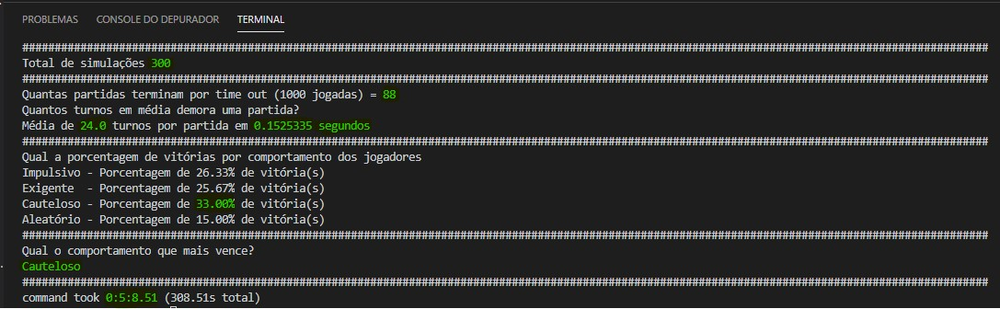

<h1 align="center">
  BrasilPrev - Desafio - Banco Imobiliário
</h1>

O programa proposto executa 300 simulações, imprimindo no console os dados referentes às execuções. 

- Quantas partidas terminam por time out (1000 rodadas);
- Quantos turnos em média demora uma partida;
- Qual a porcentagem de vitórias por comportamento dos jogadores;
- Qual o comportamento que mais vence.

## 👨🏼‍💻 Desenvolvedor

- [Paulo Henrique Bernardes Martins](http://phdeveloper.com.br/)

## 🚀 Tecnologias

- [Python](https://www.python.org/)

## ✋🏻 Pré-requisitos

- [Python](https://www.python.org/)

## 🔥 Instalação e execução

1. Faça um clone desse repositório;
2. Entre na pasta `cd BrasilPrev-Desafio`;
3. Rode `python inicio.py` para executar as simulações;

## 📚 Implementação

A pasta BrasilPrev-Desafio é a raiz principal da aplicação:

`=> BrasilPrev-Desafio`
- `inicio.py` (Arquivo de inicialização do projeto)
- `...`

Os recursos da implementação se encontra na pasta src:

`BrasilPrev-Teste => src `
- `comportamento.py` (Definição do comportamento dos jogadores...)
- `estado.py` (Carrega algumas variáveis na inicialização...)
- `excluir_jogador.py` (Função para excluir o jogador da partida...)
- `finalizando.py` (Geração do relatório no terminal...)
- `jogadores.py`(Controi aleatoriamente os jogadores definindo quem começa a partida...)
- `pagar_aluguel.py` (Função global para pagamento do aluguel...)
- `tabuleiro.py` (Controi o tabuleiro com valores aleatorios para compra e venda de imovel...)
- `tools.py` (Arquivo de apoio para construções das funções...)
---
